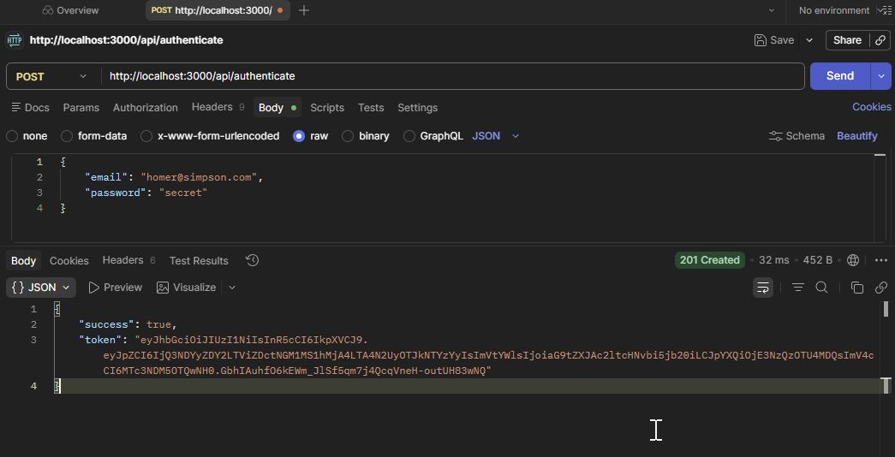
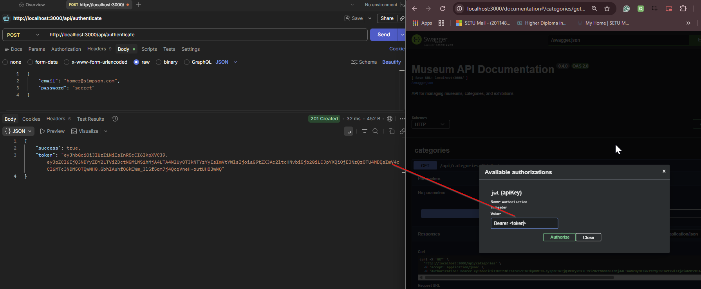

# Museum App API - Documentation & Testing Guide

This guide explains how to authenticate and interact with the Museum App API using PowerShell.

## 1. Prerequisites

Before testing, ensure:
* The server is running: `npm run dev`
* The `.env` file contains a valid `JWT_SECRET`.
* Your MongoDB is connected and contains a user (e.g., `homer@simpson.com`).

---

## 2. Authentication (Login)

To access protected routes, you must first exchange your credentials for a JSON Web Token (JWT).

### PowerShell Command:
```powershell
$response = Invoke-RestMethod -Uri "http://localhost:3000/api/authenticate" `
  -Method Post `
  -ContentType "application/json" `
  -Body '{"email":"homer@simpson.com","password":"secret"}'
````
### To copy "Bearer <token>" to Swagger:
````powershell
"Bearer $($response.token)" | Set-Clipboard
````
### Test API Categories:
````powershell
Invoke-RestMethod -Uri "http://localhost:3000/api/categories" `
  -Method Get `
  -Headers @{ Authorization = "Bearer $($response.token)" }
````

---

---

## 5. Testing with Postman

If you prefer using a visual tool, follow these steps in Postman:

### Step A: Authenticate (Get Token)
1. **Method**: Set to `POST`.
2. **URL**: `http://localhost:3000/api/authenticate`.
3. **Body Tab**: 
   * Select **raw**.
   * Select **JSON** from the dropdown.
   * Paste: 
     ```json
     {
       "email": "homer@simpson.com",
       "password": "secret"
     }
     ```
4. **Send**: Click Send. Copy the `token` string from the JSON response.

### Step B: Get Categories (Use Token)
1. **Method**: Set to `GET`.
2. **URL**: `http://localhost:3000/api/categories`.
3. **Auth Tab**:
   * Select **Type**: `Bearer Token`.
   * **Token Field**: Paste the long string you copied in Step A.
4. **Send**: You should see the list of categories in the response pane below.




---

## 6. Pro-Tip: Postman Variables
To avoid copy-pasting every time:
1. In the **Authenticate** response, highlight the token value.
2. Right-click it and select **Set: [Environment]** > **New Variable**.
3. Name it `myToken`.
4. In your **Get Categories** request, set the Bearer Token value to `{{myToken}}`.

